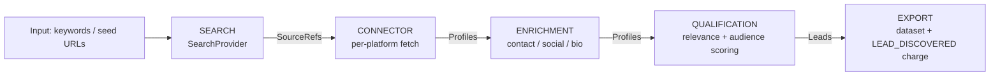

# AZ PulseLeads — Architecture

*An AZULGANZES TECHNOLOGIES product.*

**Status:** Frozen connector architecture. Substack is Connector #1 (implemented); other
platforms are documented extension points. Adding a platform requires **no core changes**.

## Pipeline (immutable spine)

Only **Connectors** and **SearchProviders** know about a specific external platform. The
orchestrator, enrichment, qualification, and export services are platform-agnostic.

## Core contracts

- `SourceRef(platform, identifier)` — a discovered source (e.g. a Substack domain).
- `Profile(platform, source_id, name, bio, avatar, public_email, socials, audience_size, raw)`
- `Lead(profile, relevance_score, audience_score, qualified, contact_ready)`
- `SourceConnector` (ABC): `fetch_profiles(ref, limit, client)` + optional `enrich_profile`.
- `SearchProvider` (ABC): `search(query, limit) -> list[SourceRef]`.
- `ConnectorRegistry`: `register` / `get(platform)` — auto-routes by `SourceRef.platform`.

## Connectors

| Connector | Status | Notes |
|---|---|---|
| **Substack** | **IMPLEMENTED** | Adapter over AZ StackPulse `SubstackFetcher` (RSS + author API + robots + proxy + retry). |
| Medium | Extension point | `fetch_profiles` via Medium public API/RSS. |
| GitHub | Extension point | Via GitHub REST/GraphQL; map repos → maintainers. |
| YouTube | Extension point | Via YouTube Data API; map channels → creators. |
| Blogs (RSS) | Extension point | Generic RSS connector reusing the AZ StackPulse parser. |

## Search providers

| Provider | Status | Notes |
|---|---|---|
| DuckDuckGo (HTML) | IMPLEMENTED (MVP) | Free, proven concept; default for keyword mode. |
| SerpAPI | Extension point | Production-grade keyword → sources. |
| Bing Web Search | Extension point | Production-grade. |

## Pricing

- Event `LEAD_DISCOVERED` charged per qualified lead **with** a public contact.
- Base events: `apify-actor-start`, `apify-default-dataset-item`.
- Intended prices: start $0.00005, dataset-item $0.00050, `LEAD_DISCOVERED` $0.00030.

## Adding a new platform (no core change)

1. Create `src/connectors/<platform>.py` with `class <Platform>Connector(SourceConnector)`.
2. Decorate `@ConnectorRegistry.register`.
3. Optionally add a `SearchProvider` if the platform is discoverable by keyword.
4. Ship. Orchestrator, enrichment, qualification, export untouched.
